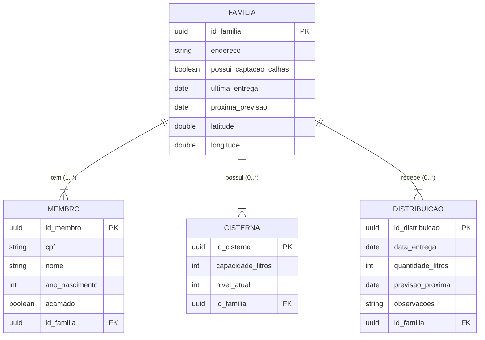

# Projeto-Back-End-Mais-Agua-Para-Nosso-Povo
Desafio de estudo diretamente tirado de Usina Pernambucana de Inovação do programa Desafios Day.

---

## Público alvo:
O público-alvo é em sua maioria constituída por agricultores familiares do município de Jupi/PE, logo todos são moradores da rural do referido município. 

## Solução esperada:
Através do sistema, esperamos que ao considerar o número de pessoas de cada núcleo familiar haja uma distribuição igualitária, logo, o sistema deverá calcular o número de pessoas residentes na casa x a quantidade de água suficiente para o consumo daquela casa. Após isso, o sistema deverá considerar a capacidade em litros de cada cisterna daquele núcelo familiar. Logo, saberemos com base na capacidade uma previsão de quando será necessário enviar água. 

É de fundamental importância que o sistema contenha as datas em que cada família recebeu água, uma previsão do novo fornecimento, dados de cada família (nome, idade, se há algum membro familiar acamado) e informações no sistema se o núcleo familiar tem sistema de captação de água por calhas. 

---

## Informações complementares:
A Secretaria Municipal de Agricultura, Meio Ambiente e
Desenvolvimento Econômico de Jupi/PE tem feito um georreferenciamento das cisternas da zona rural, atrelado a isto, temos feito um recadastramento com todos os beneficiários que recebem água da zona rural. A ação tem como finalidade criar um banco de dados na secretaria contendo: nome, coordenada
geográfica de cada cisterna e capacidade de cada uma delas em litros, quantidade de moradores por residência, ausência ou presença de calhas, presença de pessoas acamadas, entre outras informações.

O intuito é planejar de modo mais eficiente a distribuição de água
considerando o consumo de cada núcleo familiar e obtendo informações sobre
os envios de água e a previsão de novas remessas, em resumo.


### [Link-do-desafio](https://desafios.pe.gov.br/challenge?url=mais-agua-para-nosso-povo-1)

---

## Modelagem do banco



---

## Ferramentas utilizadas:

| Spring | Java | Maven | MySQL |
|--------|------|-------|-------|
| <div align="center"></div> | <div align="center"></div> | <div align="center"></div> | <div align="center"></div> |
| Spring 3.5.7 | OpenJDK 21.0.9<br>(2025-10-21) | Apache Maven 3.9.11 | MySQL 8 / MariaDB 12.0.2 |

---
# Como testar a API localmente

## Pré-requisitos

Antes de rodar a API, certifique-se de ter instalado:

* [OpenJDK 21.0.9](https://www.oracle.com/java/technologies/downloads/#jdk21-windows)
* [Apache Maven 3.9.11](https://maven.apache.org/docs/3.9.11/release-notes.html)
* [MariaDB 12.0.2](https://mariadb.org/download/?t=mariadb&p=mariadb&r=12.0.2&os=windows&cpu=x86_64&pkg=msi&mirror=fder)

> **Observação:** O MariaDB é compatível com MySQL.

---

## Instalando e iniciando o projeto

### Clone o repositório

```bash
git clone https://github.com/ricardoo-azevedo/Projeto-Back-End-Mais-Agua-Para-Nosso-Povo.git
```

### Configure o banco de dados

- Entre na pasta de recursos da API:

```
api-agua-para-todos-spring/src/main/resources
```

- Abra o arquivo `application.properties`.

- Altere o usuário e a senha do banco para os seus:

```properties
spring.datasource.username=seuusuario
spring.datasource.password=suasenha
```

---

### Rode a API

Abra o terminal na raiz do projeto e execute:

```bash
mvn spring-boot:run
```

---

## Testando a API

Após iniciar a aplicação, você pode acessar a documentação interativa e testar os endpoints diretamente no seu navegador:

[🔗 Testar API no Swagger](http://localhost:35555/swagger-ui/index.html#/)


